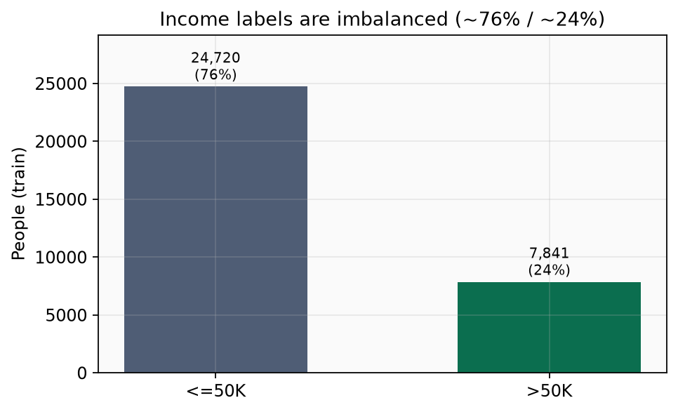
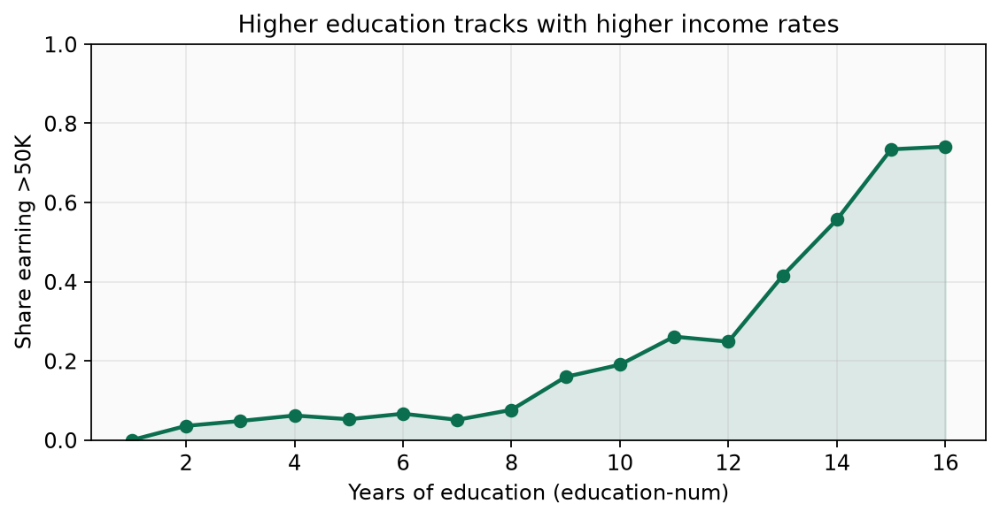
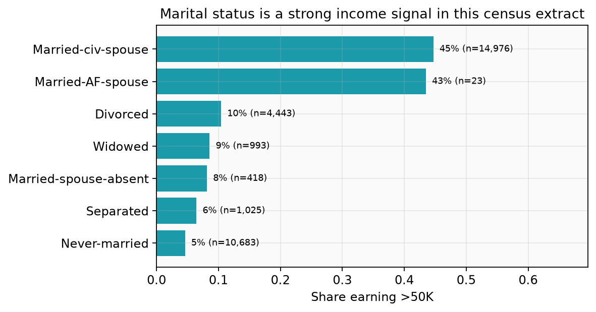
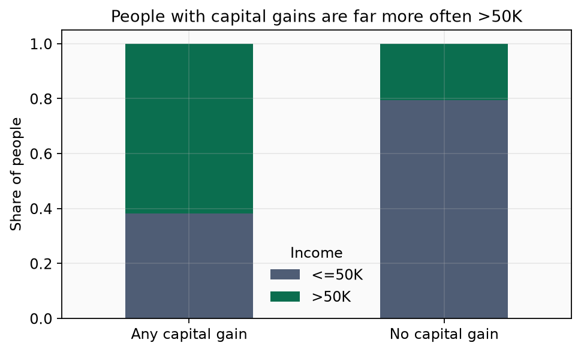
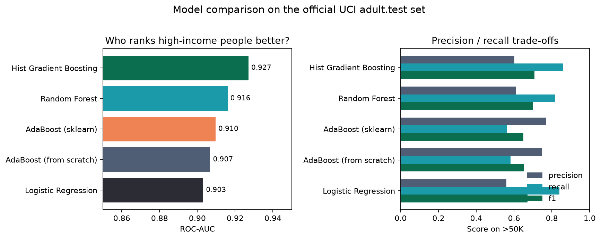
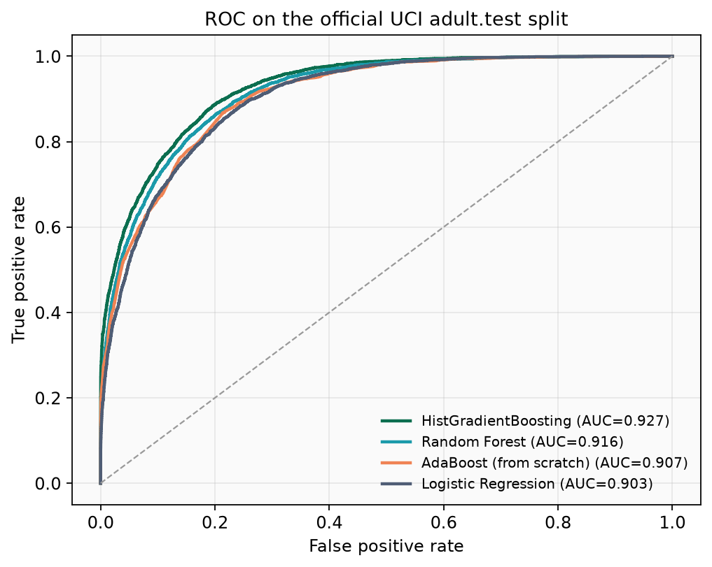
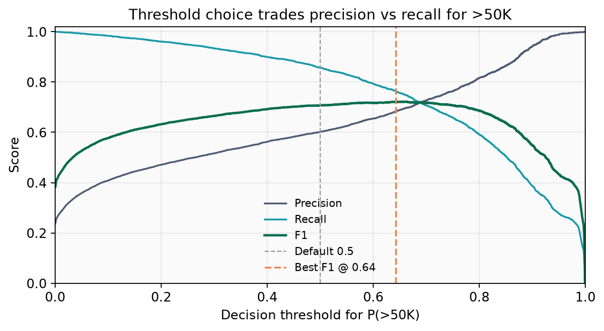
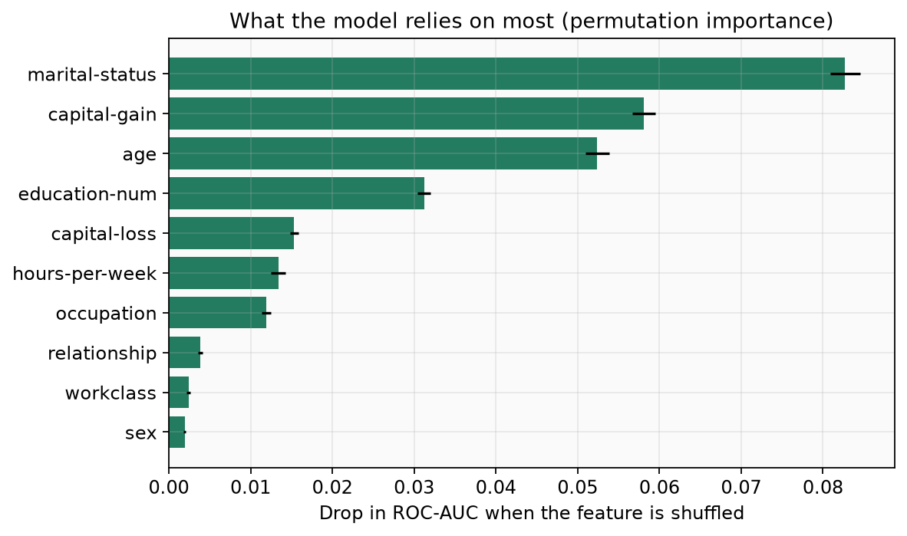
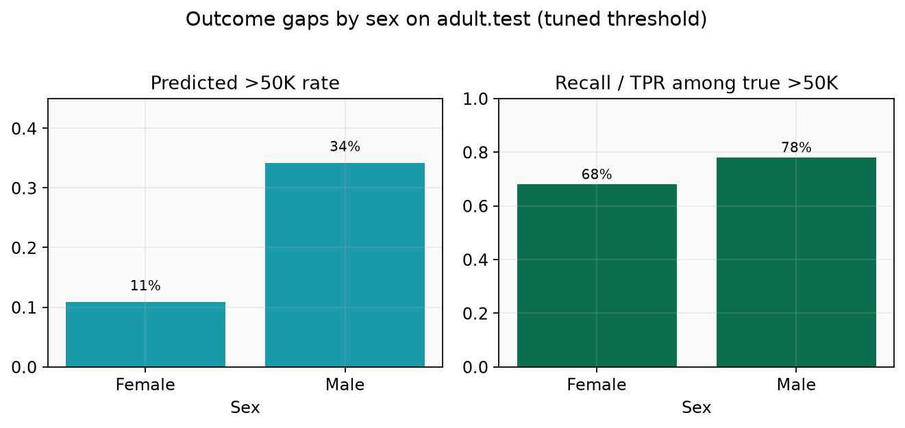

# Income Prediction Classifier

Can we tell, from census attributes alone, whether someone earns more than $50K a year — and can we do it without treating boosting as a black box?

That is the use case behind this project. Using the [UCI Adult Census Income](https://archive.ics.uci.edu/dataset/2/adult) extract, the repo builds an AdaBoost model from first principles, then compares it with modern tabular learners on the official train/test split.

## The problem

About three in four people in the training data earn **$50K or less**. A model that always predicts the majority class looks “accurate” and still fails the use case.

  

<em>Figure 1.</em> Target imbalance on <code>adult.data</code>. The interesting class is the smaller <code>&gt;50K</code> group, so ranking and F1 matter more than raw accuracy.

Income is not random noise around that base rate. Education, family structure, and capital gains shift the odds in clear ways:

  

<em>Figure 2.</em> Share of people earning <code>&gt;50K</code> rises steadily with years of education.

  

<em>Figure 3.</em> Married civilian spouses show a much higher high-income rate than never-married respondents in this 1994 extract.

  

<em>Figure 4.</em> Among people with any capital gain, the majority are <code>&gt;50K</code>; without capital gains, most are not. That signal was missing from the original six-feature notebook.

## Approach

1. **AdaBoost from scratch** — decision stumps, weighted error $\varepsilon_t$, stump weight $\alpha_t$, and sample reweighting, implemented so the boosting loop is readable.
2. **Same task, stronger features** — age, education, hours, occupation, marital status, relationship, capital gain/loss, and related fields (not only the original small subset).
3. **Honest comparison** — logistic regression, random forest, sklearn AdaBoost, the custom AdaBoost, and histogram gradient boosting, scored on the official `adult.test` set.

The AdaBoost update used in the from-scratch model is:

$$
\varepsilon_t = \sum_{i=1}^{n} w_t(i)\,\mathbb{1}\{y_i \neq f_t(x_i)\}
\qquad
\alpha_t = \frac{1}{2}\ln\frac{1-\varepsilon_t}{\varepsilon_t}
$$

$$
\hat{w}_{t+1}(i) = w_t(i)\,e^{-\alpha_t y_i f_t(x_i)}
\qquad
w_{t+1}(i) = \frac{\hat{w}_{t+1}(i)}{\sum_j \hat{w}_{t+1}(j)}
$$

$$
F(x) = \mathrm{sign}\!\left(\sum_{t=1}^{T} \alpha_t f_t(x)\right)
$$

## What the models achieve

On the official UCI test set (`adult.data` → train, `adult.test` → test):

| Model | ROC-AUC | F1 (`>50K`) | Accuracy |
|-------|---------|-------------|----------|
| Hist Gradient Boosting | **0.927** | **0.707** | 0.833 |
| Random Forest | 0.916 | 0.699 | 0.833 |
| AdaBoost (sklearn) | 0.910 | 0.650 | **0.857** |
| AdaBoost (from scratch) | 0.907 | 0.654 | 0.854 |
| Logistic Regression | 0.903 | 0.671 | 0.806 |

  

<em>Figure 5.</em> Left: ranking quality (ROC-AUC). Right: precision / recall / F1 for the high-income class. Gradient boosting leads on ranking and F1; AdaBoost wins raw accuracy with a more conservative <code>&gt;50K</code> call.

  

<em>Figure 6.</em> ROC curves on <code>adult.test</code>. The from-scratch AdaBoost sits close to sklearn AdaBoost; histogram gradient boosting pulls ahead.

A default 0.5 probability cut is not automatically the right operating point for this use case. Choosing the threshold that maximizes F1 on a validation slice of the training data moves F1 on test from about **0.707 → 0.72**:

  

<em>Figure 7.</em> As the decision threshold rises, precision for <code>&gt;50K</code> improves and recall falls. The orange line marks the F1-optimal cut for the best model.

## What drives the prediction

  

<em>Figure 8.</em> Permutation importance on <code>adult.test</code>: shuffling marital status or capital gain hurts ROC-AUC the most, followed by age and education. That matches the exploratory patterns above.

## A fairness check on the same use case

Adult includes protected attributes. The point here is transparency for the case study, not a claim that the model is deployable:

  

<em>Figure 9.</em> On <code>adult.test</code>, men are predicted <code>&gt;50K</code> more often and true high-income men are recovered at a higher rate than women. Any real-world income decisioning would need a separate fairness and governance review.

## Where to go next in the repo

- Narrative write-up with the same plots and equations: [`docs/DOCUMENTATION.md`](docs/DOCUMENTATION.md)
- AdaBoost walkthrough notebook: [`notebooks/01_adaboost_walkthrough.ipynb`](notebooks/01_adaboost_walkthrough.ipynb)
- Package code: [`src/income_classifier/`](src/income_classifier/)
- Checked-in metrics: [`results/`](results/)

**Juan David Prada Malagon**
